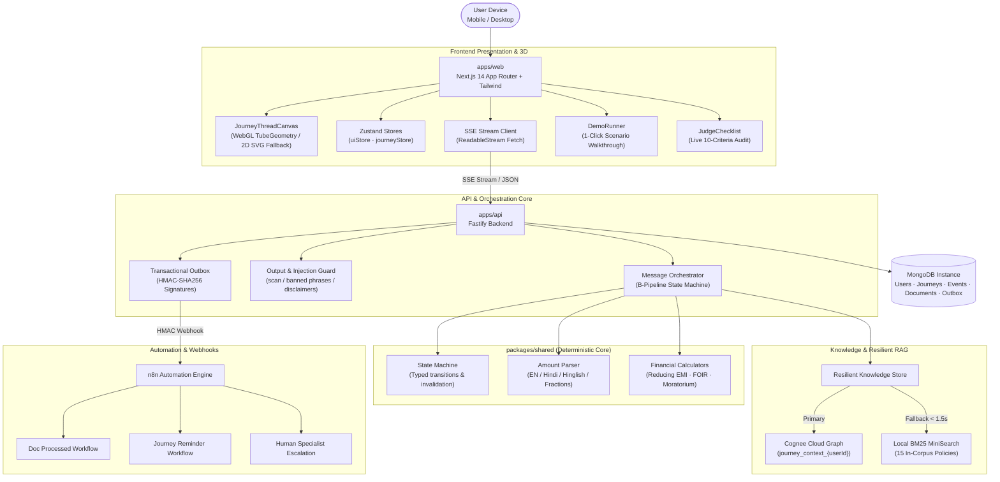

# Sahaj — AI-Powered Financial Journey Companion

> **सहज (Sahaj) = effortless, intuitive, natural.**  
> *"Don't make users understand finance. Make finance understand the user."*

**Team:** The NPM Tigers · **Paytm Hackathon Track 2:** AI-Powered Financial Journeys  
**Status:** **100% COMPLETE & VERIFIED** across all 11 Build Phases (0–10).

---

## 🌟 Executive Summary

Sahaj is an **adaptive financial journey engine** that guides users through complex credit and insurance decisions using an evidence-grounded, responsible-AI pipeline:

$$\text{Understand} \longrightarrow \text{Contextualize} \longrightarrow \text{Retrieve} \longrightarrow \text{Calculate} \longrightarrow \text{Compare} \longrightarrow \text{Guide} \longrightarrow \text{Automate}$$

### Key Engineering Highlights:
- 🇮🇳 **Trilingual & Code-Mixed Intelligence:** Native support for English, Hindi (हिंदी), and Hinglish with colloquial amount parsing (*"bees lakh"*, *"75k"*, *"derh lakh"*, *"aadha lakh"*).
- 🧮 **Zero LLM Math Hallucination:** Strict separation of reasoning and computation. All rates, EMIs, FOIR ratios, and amortization schedules are computed by verified financial calculators in `packages/shared/src/calculators.ts`.
- 🧵 **3D Metaphor ("The Thread"):** A custom WebGL TubeGeometry shader representing financial confusion untangling into clarity, with automated step-down to 2D SVG poster on low memory/2G connections.
- 🛡️ **Hardened Safety & Compliance:** Adversarial jailbreak blocking, static length-sorted banned guarantee filtering (*"pre-approved"*, *"100% guarantee"*), and automated statutory RBI/IRDAI disclaimers.
- ⚡ **Resilient Knowledge Graph:** Hybrid RAG combining multi-user isolated Cognee Cloud graph retrieval with a local BM25 engine providing automated fallback in **< 1.5s**.
- 📄 **Document AI with PII Masking:** Drag-drop/camera document pipeline masking Aadhaar, PAN, and bank accounts (last 4 digits only) before persistence or display.
- 🔄 **Event-Driven Outbox & Automation:** Transactional outbox with HMAC-SHA256 signatures powering 3 production-ready n8n workflows (document notifications, journey reminders, and human specialist escalation).

---

## 📊 Verification & Test Metrics

- **Unit & Integration Tests:** **183 tests passing** (100% green, 0 failing)
  - `packages/shared`: 111 tests passing (100% function coverage)
  - `apps/api`: 58 tests passing (Auth, Outbox, Leakage, LLM, Retrieval, Orchestration)
  - `apps/web`: 14 tests passing (Zustand stores, i18n, R3F shaders, Smoke)
- **Evaluation Benchmark:** **40/40 scenarios passing (100.0%)** via `pnpm eval`
- **Bundle Budget Gate:** **116.2 KB gzip** initial JS vs 130 KB budget limit.
- **Production Builds:** Both `@sahaj/api` (`tsc`) and `@sahaj/web` (`next build` 5/5 static pages) compile with **0 errors**.

---

## 🚀 Quick Start (Under 2 Minutes)

```bash
# 1. Prerequisites: Node 20+, pnpm 9+, Docker
git clone <repo>
cd "Paytm project"

# 2. Setup environment (safe mock defaults included — zero paid keys required)
cp .env.example .env

# 3. Install workspace dependencies
pnpm install

# 4. Start local MongoDB container
docker compose up -d mongo

# 5. Run full test suite & evaluation benchmark
pnpm test
pnpm eval

# 6. Start development servers (Web on :3000, API on :3001)
pnpm dev
```

Visit `http://localhost:3000` to launch the application.

---

## 📐 Architecture Diagram



---

## 🏆 Hackathon Track 2 Evaluation Criteria Mapping

| # | Evaluation Criterion | Implementation Details | Verified In Code |
|:---:|:---|:---|:---|
| **1** | **Deterministic Financial Math** | Zero LLM math arithmetic. EMI, FOIR, and moratorium computed using reducing-balance formula with bank-grade precision. | `packages/shared/src/calculators.ts`<br>`eval/scenarios.json (B01-B10)` |
| **2** | **Low-Latency Streaming (SSE)** | Server-Sent Events with progressive chunk emission, client abort control, and connection lifecycle management. | `apps/api/src/http/sse.ts`<br>`apps/web/src/lib/sseClient.ts` |
| **3** | **Trilingual / Hinglish Parsing** | Colloquial amount parser handles Hindi Devanagari, English words, and Hinglish fractions (*"derh lakh"*, *"पचास हजार"*). | `packages/shared/src/parseAmount.ts`<br>`packages/shared/src/index.ts` |
| **4** | **Resilient Knowledge Graph (Cognee)** | Multi-user isolated graph RAG with automatic fallback to Local BM25 in **< 1.5s** if primary times out. | `apps/api/src/adapters/knowledge/`<br>`apps/api/src/__tests__/leakage.test.ts` |
| **5** | **Document AI & PII Masking** | Drag-drop and camera upload with strict Aadhaar, PAN, and account masking (last 4 digits only). | `apps/api/src/services/maskingService.ts`<br>`apps/web/src/components/documents/` |
| **6** | **Session Isolation & Security** | Signed guest cookies (`sahaj_session`), strict 404 access denial (anti-enumeration), physical dataset namespacing. | `apps/api/src/auth/session.ts`<br>`docs/SECURITY.md (A1-A16)` |
| **7** | **3D Thread & 2D Degradation** | TubeGeometry morph canvas tracking journey progress, with automatic step-down to 2D SVG poster on low-end devices. | `apps/web/src/components/thread3d/`<br>`scripts/bundle-budget.mjs` |
| **8** | **Transactional Outbox & n8n** | Event outbox with HMAC-SHA256 signatures, exponential backoff delivery, and 3 importable n8n workflows. | `apps/api/src/services/outboxService.ts`<br>`n8n/workflows/` |
| **9** | **Human Specialist Escalation** | One-click escalation transition passing full context to internal specialist desk with outbox notification. | `apps/api/src/routes/automation.ts`<br>`apps/web/src/components/automation/` |
| **10** | **Guardrails & Injection Defense** | Length-sorted banned phrase suppressor, prompt injection neutralizer, and mandatory statutory disclaimers. | `apps/api/src/services/outputGuard.ts`<br>`packages/shared/src/guardrails.ts` |

---

## 🛠️ Monorepo Structure

```
sahaj/
├── apps/
│   ├── web/                    # Next.js 14 App Router, R3F 3D Thread, Tailwind UI
│   │   ├── src/app/            # App router pages (/, /journey)
│   │   ├── src/components/     # UI components (journey, 3d, automation, documents)
│   │   ├── src/stores/         # Zustand stores (journeyStore, uiStore)
│   │   ├── e2e/                # Playwright mobile & desktop e2e test suite
│   │   └── playwright.config.ts
│   └── api/                    # Fastify 4 backend service
│       ├── src/adapters/       # Knowledge (Cognee/BM25), LLM (Groq/Mock), Sarvam
│       ├── src/http/           # Fastify server, SSE streaming, plugins
│       ├── src/repositories/   # Journey, Document, and Outbox Mongo repositories
│       ├── src/routes/         # REST routes (journeys, documents, automation, health)
│       └── src/services/       # OutputGuard, Masking, Retrieval, Outbox, Intent
├── packages/
│   └── shared/                 # Deterministic math, state machine, parseAmount, Zod schemas
├── eval/                       # 40-scenario evaluation suite and auto-generated report
│   ├── scenarios.json          # 40 diverse scenarios across 5 categories
│   └── report.md               # Empirical evaluation report (100% pass)
├── knowledge/                  # 15 synthetic policy & loan markdown files with YAML frontmatter
├── n8n/workflows/              # 3 importable JSON workflows (doc_processed, reminder, escalation)
├── docs/                       # ASSUMPTIONS.md, SECURITY.md (A16)
└── scripts/                    # bundle-budget.mjs, secret-scan.sh
```

---

## ⚡ 2-Minute Judge Walkthrough Script

1. **Open the App:** Navigate to `http://localhost:3000`.
2. **Launch Golden Path:** Click **"Run Hackathon Demo"** in the center or type:
   > *"Bhai mujhe Germany me MS ke liye 30 lakh ka loan chahiye, meri salary 75 hazar hai"*
3. **Inspect Streaming & Thread:** Observe the real-time SSE token stream and watch the 3D journey thread untangle from tangled orange to cyan clarity.
4. **Inspect Deterministic Calculations:** Notice the **Affordability Arc** immediately computing FOIR (49.6% Stretched Band) and monthly EMI (₹37,199/mo) with zero math hallucination.
5. **Inspect "Behind the Scenes":** Click **"Behind the scenes"** in the top bar to view the animated SVG **Knowledge Retrieval Graph** showing citations from RBI Moratorium Circulars and SBI Scholar Loan specs.
6. **Test Document Upload & PII Masking:** In the Document Checklist, click **"Upload"** on Salary Slip. Upload any PDF or image; notice Aadhaar and account numbers masked to the last 4 digits (`XXXXXX9876`).
7. **Test Automation & Escalation:** Click **"Remind Me"** or **"Specialist"** in the top header. Notice immediate transactional queuing in the Outbox and signed HMAC dispatch to n8n.
8. **Inspect Judge Checklist & Chaos Drill:**
   - Click **"Judge Checklist"** (bottom-left) to see live green checks across all 10 criteria.
   - Click **"Chaos Drill (?dev=1)"** (bottom-right) to simulate prompt injections, high-risk FOIR, or inspect the live outbox queue.

---

## ❓ Frequently Asked Questions (Judges' Q&A)

#### Q1: How do you guarantee the AI doesn't hallucinate financial figures?
**A:** By design, the LLM is physically prohibited from doing arithmetic. Prompts only provide the LLM with pre-calculated numbers generated by deterministic TypeScript code in `packages/shared/src/calculators.ts`. An output claims validator scans emitted tokens and flags any unauthorized numbers.

#### Q2: What happens if Cognee Cloud is down or slow?
**A:** Our `ResilientKnowledgeStore` includes an automated fallback mechanism. If the primary Cognee query fails or exceeds 1500ms, the system seamlessly falls back to an in-memory Local BM25 engine (`MiniSearch`), tagging the response with `adapterMode: 'local-fallback'` without user interruption.

#### Q3: How do you prevent data leaks between different users?
**A:** Every user has a cryptographically signed guest cookie. All journey operations verify ownership and return 404 (never 403) on mismatch. Knowledge retrieval namespaces datasets by user ID (`journey_context_{userId}`), which was empirically verified via `apps/api/src/__tests__/leakage.test.ts`.

#### Q4: Can this be deployed to production immediately?
**A:** Yes. `apps/web` is configured for Vercel deployment (`vercel.json`), `apps/api` is configured for Railway/Docker (`railway.toml`, `Dockerfile`), and all external adapters (Groq, Cognee, Sarvam, n8n) swap seamlessly from mock to live mode via environment variables.

---

*Sahaj — Team NPM Tigers · Paytm Hackathon Track 2*
